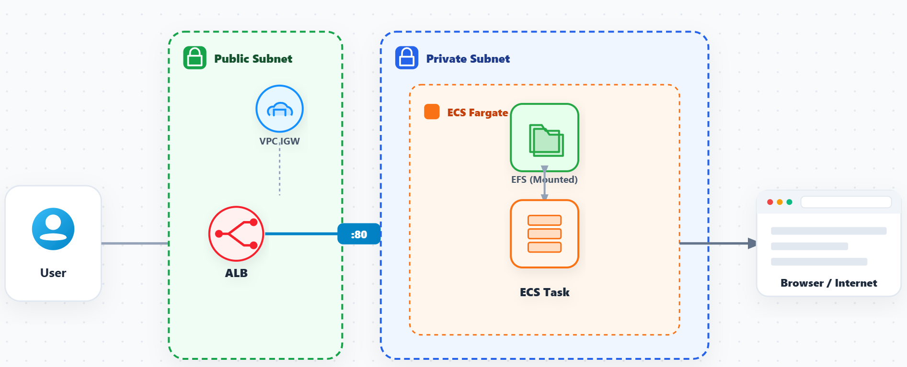
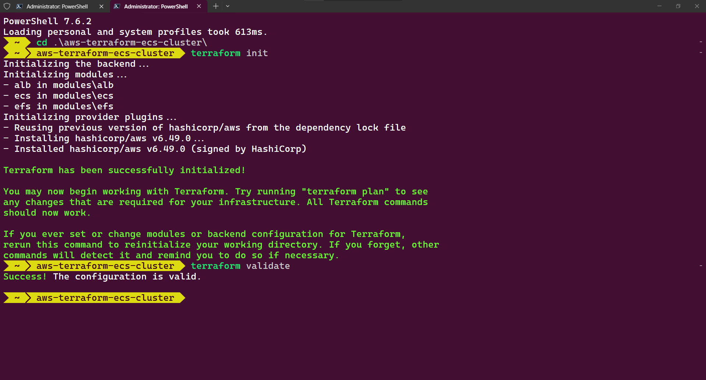
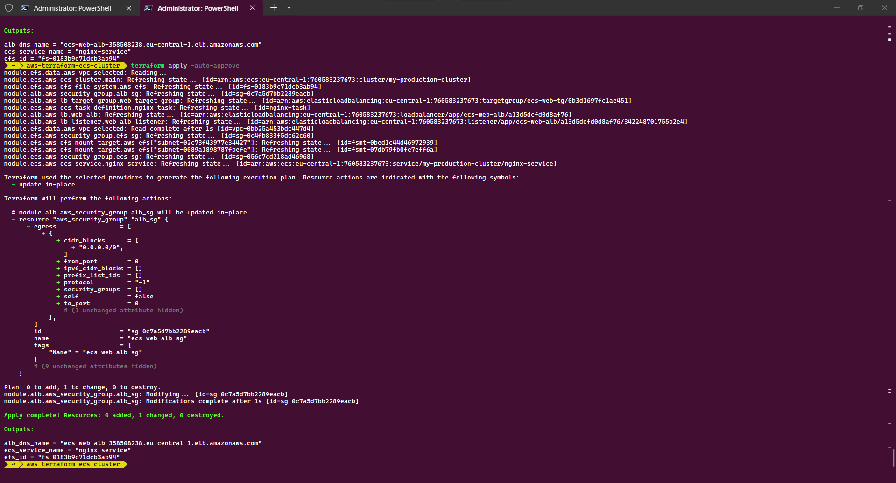
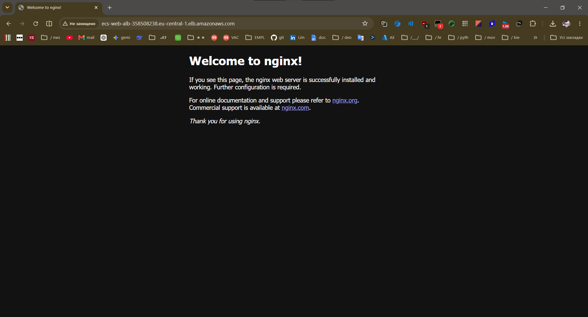

# ☁️ Scalable AWS ECS Cluster via Terraform
**Architected and provisioned by Leonid Lachmann**

This repository contains an Infrastructure as Code (IaC) solution using Terraform to provision a highly available, containerized web application infrastructure on Amazon Web Services (AWS), **designed for fault tolerance and strict network isolation in high-load environments.**

The architecture leverages **Amazon ECS (Fargate)** for serverless container execution, **Amazon EFS** for persistent shared storage across containers, and an **Application Load Balancer (ALB)** for traffic distribution.

## 🏗️ Architecture & Enterprise Readiness

The infrastructure is built using a modular Terraform approach, ensuring reusability, maintainability, and clear separation of concerns, **aligning with enterprise compliance standards**.

* **Networking & High Availability (`alb` module):** An Application Load Balancer dynamically routes HTTP traffic to healthy ECS tasks across multiple Availability Zones, **ensuring fault tolerance and SLA 99.9%+ adherence for high-load environments**.
* **Compute Orchestration & Isolation (`ecs` module):** Utilizes AWS Fargate to run Nginx containers without managing underlying EC2 instances. Tasks are secured with strict Security Groups, **enforcing a zero-trust network model, workload isolation, and least-privilege execution**.
* **Persistent & Secure Storage (`efs` module):** An **encrypted-at-rest** Amazon Elastic File System is mounted to the ECS tasks, providing persistent, shared storage for Nginx configuration files and HTML content **without compromising data security**.

### Infrastructure Diagram


## 🚀 Deployment Guide

### Prerequisites
* [Terraform](https://developer.hashicorp.com/terraform/downloads) v1.0+
* [AWS CLI](https://aws.amazon.com/cli/) installed and configured (`aws configure`)
* Docker (for local testing via Compose)

### 1️⃣ Local Testing (Docker Compose)
Before deploying to AWS, you can validate the container configuration locally:
```bash
docker compose up -d
# Access the local application at http://localhost:80
# Stop the local environment: docker compose down
```

### 2️⃣ Provisioning AWS Infrastructure
Ensure your AWS credentials are valid, then initialize and apply the Terraform configuration:
```bash
cd terraform
terraform init
terraform validate
terraform plan
terraform apply -auto-approve
```

*terraform init and terraform validate*




*terraform apply -auto-approve*



### 3️⃣ Verification
Upon successful deployment, Terraform will output the DNS name of the Application Load Balancer. Navigate to this URL in your browser:
```bash
http://<alb_dns_name>
```
*Expected Result:*



### 4️⃣ Teardown
To prevent ongoing AWS charges, destroy the infrastructure when it is no longer needed:
```bash
terraform destroy -auto-approve
```

---
*A special thanks to Illia Losiev for his valuable support, guidance, and code reviews during the initial development of this infrastructure setup.*
